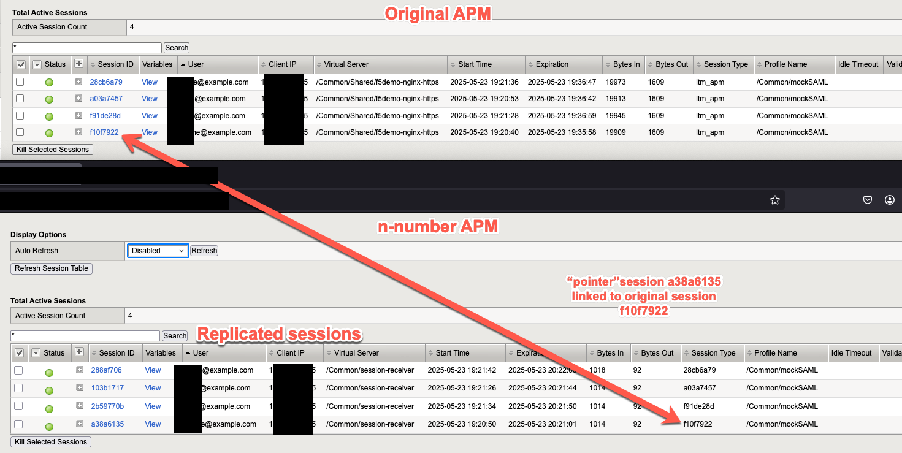
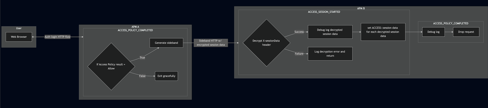
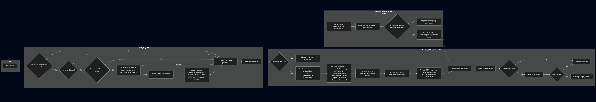
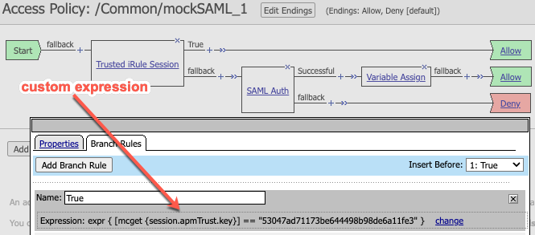

### Latest Version: 1.0.2

### Overview
- This iRule provides session replication functionality for APM.
- Successful APM user sessions will be replicated across n-number Active/Active BIG-IP APM devices.
- In the event an APM device fails or session persistence is lost, the user will be able to continue their session on another APM device without having to re-authenticate.
    - In practice, this is done by copying the MRHSession cookie value from the original APM device to the peer APM devices inside a new sessionID, which I refer to as the "pointer session".



### Design Principles
- Re-use as much APM code as possible to benefit from built-in security and performance.
- APM Session cookie creation and validation performed by APM as normal.
- This iRule allows the peer APM devices to trust the MRHSession cookie value from the original APM device by swapping the MRHSession cookie value in `HTTP_REQUEST` event before APM Access Policy is evaluated with the MRHSession value of the valid pointer session.
    - The MRHSession cookie value is NOT overwritten with pointer session cookie in the event the original APM device becomes unavailable again.
- Lightweight, sessions are replicated per-request at end of Access Policy Completion.
    - Its possible a peer APM device could lose all APM session state (reboot) and would not be able to validate MRHSession cookies contained in the pointer sessions that were deleted. A secondary on demand bulk-replication could be created for that use-case.

## iRule Flow

### Receive APM Sideband Flow


### Send APM Sideband Flow


### Requirements
- APM policy with `User Identification Method` = `HTTP` which means MRHSession cookie is used for session identification.
- Enough architectural session persistence to establish a session with a single BIG-IP APM
    - Must be able to reach ACCESS_POLICY_COMPLETED event so that the successful session can be replicated.
    - Example:
        - Active/Active APM via DNS
        - 2 tier Active/Active APM with LB in front of APM devices performing some form of session persistence such as source IP persistence or cookie persistence.
- BIG-IP APM version 17.1 or later.

## Pre-requisites
- One sideband virtual server must be created on each APM device.
    - This is a special virtual server that will receive the sideband communication between APM devices.
    - The sideband virtual server must have the following properties:
        - Type: `Standard`
        - Destination Address: `an internal Self-IP`
        - Protocol: `TCP`
        - Port: `443` (or any other port you choose, but it must match across all APM devices)
        - HTTP Profile: `http`
        - SSL Profile (Client): `NONE` (AES encryption is performed by the iRule to prevent creating many helper TLS virtual servers)
        - OneConnect Profile: `default oneconnect` (in the future this will make sideband re-use more feasible)
        - iRule: `receive_apm_sideband.tcl`
        - Pool: `none` (no pool is needed as this is a sideband communication receiver)
        - Access Policy: `Same Access policy as your real APM virtual servers or a dummy APM profile that always allows the session`
            - If re-using same access policy as real virtual servers, an encrypted in-transit APM trust key variable can be used to identify the trusted sideband communications vs real APM traffic.
            - Example:

            

- One iRule datagroup must be created on each APM device.
    - This datagroup will contain inventory of all APM devices in the local replication group to which this iRule will replicate sessions.
    - The datagroup should contain the following properties:
        - Type: `String`
        - Name: `asr_apm_inventory` (mandatory name for now as this is special datagroup)
        - Key: `{{ $HOSTNAME of APM device }}`
            - name of the APM device from `echo $HOSTNAME` to be compared with iRule variable `$static::tcl_platform(machine)` for self-identification.
        - Value: `{{ IP }}`
            - IP address of the APM device sideband virtual server.
        - Example:
            ```
            ltm data-group internal asr_apm_inventory {
                records {
                    azure-scus-f5demo-prod-B-01.local {
                        data 192.168.113.5
                    }
                    azure-scus-f5demo-prod-B-02.local {
                        data 192.168.113.6
                    }
                }
                type string
                }
            ```
- `send_apm_sideband.tcl` iRule must be applied to the virtual server that is handling APM traffic.
- `receive_apm_sideband.tcl` iRule must be applied to the special sideband virtual server created for this iRule.

## iRule Variables
Customize variables:
- `send_apm_sideband.tcl`
    - `static::asr_sidebandport`to desired port of sideband virtual server (default is 9001)
    - `static::asr_sendKey` to a unique AES key used to encrypt session data. Must match the key used in the receive_apm_sideband iRule. Document example: https://clouddocs.f5.com/api/irules/AES__key.html
    - `static::asr_apmTrustKey` (OPTIONAL: if re-using same Access policy as your real APM virtual servers. ignore if using a dummy access profile on your sideband virtual server that always allows the session) set to unique string (any format/length) that must match the same variable in the in VPE custom branch.
    - `static::asr_apmInactivityTimeout` to desired idle timeout for pointer sessions (default is 3600 seconds). As these pointer sessions do not receive traffic until the original APM device becomes unavailable (at which point the standard Access Policy idle timeout applies), this timeout should be set to a value that is longer than the normal APM session idle timeout.
 - `receive_apm_sideband.tcl`
    - `asr_receiveKey` to a unique AES key used to decrypt session data. Must match the key used in the send_apm_sideband iRule. Document example: https://clouddocs.f5.com/api/irules/AES__key.html


## AS3 Examples
#### Create iRules
```json
"receive_apm_sideband.tcl": {
    "class": "iRule",
    "iRule": {
        "url": "https://raw.githubusercontent.com/megamattzilla/iRules/refs/heads/master/APM_Session_Replication/receive_apm_sideband.tcl"
    }
},
"send_apm_sideband.tcl": {
    "class": "iRule",
    "iRule": {
        "url": "https://raw.githubusercontent.com/megamattzilla/iRules/refs/heads/master/APM_Session_Replication/send_apm_sideband.tcl"
    }
},
```

#### Create sideband virtual server
```json
    "ars_sideband_receiver": {
        "class": "Service_HTTP",
        "virtualPort": 9001,
        "redirect80": false,
        "virtualAddresses": [
            "{{ ipv4_intaddress }}"
        ],
        "profileMultiplex": {
            "bigip": "/Common/oneconnect"
        },
        "iRules": [
            {
                "use": "receive_apm_sideband.tcl"
            }
        ],
        "profileAccess": {
            "use": "myAccessProfile"
        },
        "allowVlans": [
            "internal"
        ]
    },
```


#### Create external datagroup
create/upload your datagroup file to a HTTPS file store. Example file at [asr_apm_inventory.txt](https://github.com/megamattzilla/iRules/blob/master/APM_Session_Replication/asr_apm_inventory.txt)

```json
    "asr_apm_inventory": {
    "class": "Data_Group",
    "storageType": "external",
    "keyDataType": "string",
    "externalFilePath": "https://raw.githubusercontent.com/megamattzilla/iRules/refs/heads/master/APM_Session_Replication/asr_apm_inventory.txt",
    "ignoreChanges": false,
    "separator": ":=",
    "label": "asr_apm_inventory"
    },
```
## Known Issues
- In some situations RULE_INIT might not run, which causes send_apm_sideband iRule to fail to send sideband until RULE_INIT runs again. I have some ideas to fix this in a future version.


## Version History

#### 1.0.2
Non-Breaking Changes:
- Added catch statement to all request driven iRule events to prevent TCL errors from rejecting connections.
- Documentation updates.

#### 1.0.1
Non-Breaking Changes:
- Will check `/Common` partition for datagroup then try `/Common/Shared`.
- Documentation updates.

#### 1.0.0 Breaking Changes
Breaking Changes:
- Replaced in-line inventory with iRule datagroup for APM inventory.


Non-Breaking Changes:
- moved in-line APM trust key to variable asr_apmTrustKey.
- Documentation updates.

#### 0.5
New Features:
- initial release
