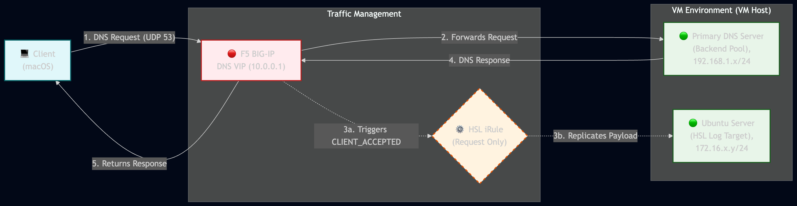

# F5 BIG-IP: Clone DNS via High-Speed Logging (HSL) & Percentage Sampling iRule

## 📖 Overview
This iRule is designed to safely duplicate incoming DNS requests (UDP Port 53) and route those payloads to an external logging server or **security inspection device** (such as an IDS/IPS, SIEM forwarder, or passive traffic analyzer). 

It includes a built-in, percentage-based sampling mechanism. This allows administrators to dynamically scale the volume of cloned traffic (e.g., sending 100% during an active investigation, or backing it down to 10% for baseline monitoring) to protect the downstream inspection device from being overwhelmed during heavy traffic spikes.

### Why use HSL instead of a standard "Clone Pool"?
Native F5 Clone Pools require the inspection device to be **Layer 2 adjacent** to the BIG-IP because the F5 only rewrites the Layer 2 MAC address of the cloned packet. 

If your log server or inspection device is located across a routed boundary (Layer 3), a native Clone Pool will fail to deliver the traffic. This iRule solves that architecture limitation by using **High-Speed Logging (HSL)** to initiate a fully routable Layer 3 connection directly to the destination pool.

---

## ⚙️ How It Works (The Logic)
Because DNS operates over UDP (a connectionless protocol), the F5 BIG-IP possesses the entire DNS query payload the moment the UDP payload is received. You do not need to have a DNS profile attached to the virtual server for this iRule to work, just a UDP profile. 

1. **Trigger:** The iRule triggers instantly when a new DNS request hits the Virtual Server (`CLIENT_ACCEPTED`).
2. **Decision:** It evaluates your configuration variables to determine if sampling is active.
3. **The Percentage Roll:** If active, the F5 generates a random integer from `0` to `99` (simulating a 100-sided die). If the roll is *less than* your target percentage, the packet is flagged to be cloned.
4. **Action:** The F5 opens a HSL connection to your inspection pool and securely transmits a duplicate of the raw UDP payload.
5. **Safety Net:** The execution logic is wrapped in a `catch` block. If the iRule experiences a TCL error the client's original DNS request continues to the backend server uninterrupted.

---

## 🛠️ Configuration & Setup

### Prerequisites
Before attaching this iRule to your Virtual Server, create a standard F5 LTM Pool for your target device(s).
* **Name:** The desired name of your pool (e.g., `remote_dns_logger_pool`).
* **Members:** The IP address of your log server, IDS, or security inspection tool.
    * If multiple IPs are in the pool, by default HSL will only send each HSL log to a single member based on the F5's load balancing method. If you want to send cloned traffic to all members, additional iRule logic will be required.
* **Port:** `53` (or the specific port your listener requires).

### iRule Variables
At the top of the iRule, there are three simple variables to control the traffic flow and destination. **This is the only section of the iRule you need to modify.**

* `hsl_pool`: 
  * The exact text name of the F5 pool you created in the prerequisites (e.g., `"remote_dns_logger_pool"`).
* `sampling_enabled`: 
  * Set to `1` to turn the percentage sampling **ON**.
  * Set to `0` to turn sampling **OFF** (Clones 100% of traffic).
* `percent_rate`: 
  * Set this to any whole number between `1` and `100`.
  * For example, `25` will replicate exactly 25% of the total DNS queries.

#### Version History

#### 5/29/2026 - Initial creation and testing. Please reach out with feedback or improvement suggestions!
