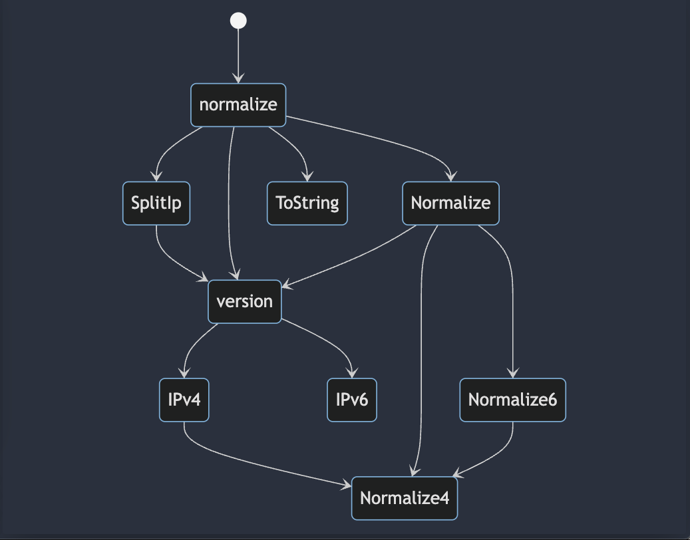
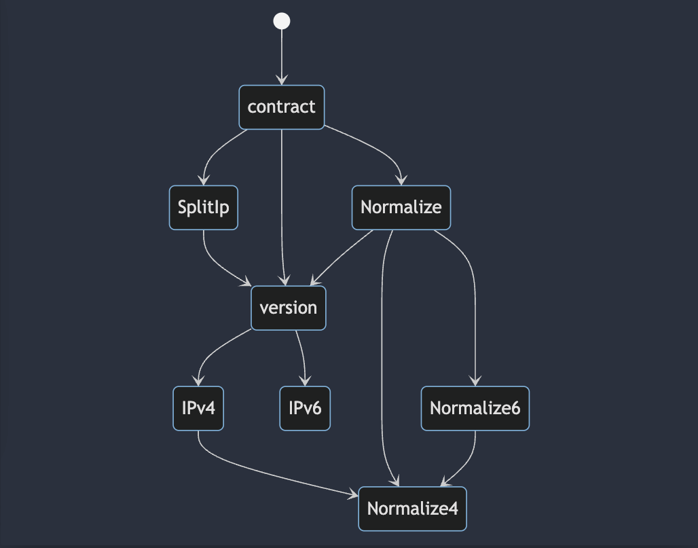
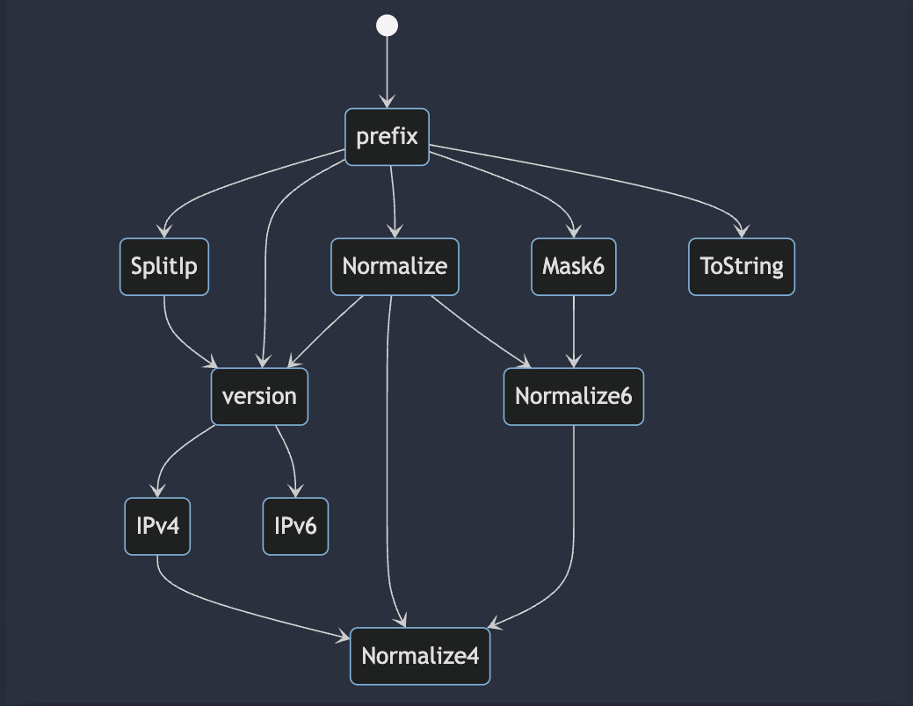

### iRule Library to expand, contract, and apply network mask to IPv6 addresses. 

Made with heart by Jason Rahm (github.com/f5-rahm) and Matt Stovall 7/2024

Jason rewrote the appropriate procedures from the TCL ip package official source to be iRules compliant from: https://github.com/tcltk/tcllib/blob/master/modules/dns/ip.tcl

### Call this library from other irules:
1. Expand an IPv6 address: `[call irule_library::normalize <short IPv6 addr>]`
2. Contract an IPv6 address: `[call irule_library::contract <long IPv6 addr>]`
3. Get the network address of an IPv6/mask: `[call irule_library::prefix <IPv6 addr (short or long)>/<CIDR mask>]` This will return long address with host bits set to 0. 


example.tcl log output:
```
<RULE_INIT>: Before Expand: 2001:db8:85a3::8a2e:370:7334
<RULE_INIT>: Expanded IPv6 addr: 2001:0db8:85a3:0000:0000:8a2e:0370:7334

<RULE_INIT>: Before Contract: 2001:0db8:85a3:0000:0000:8a2e:0370:7334
<RULE_INIT>: Contracted IPv6 addr: 2001:db8:85a3::8a2e:370:7334

<RULE_INIT>: Before /64 Mask 2001:0db8:85a3:0000:0000:8a2e:0370:7334
<RULE_INIT>: Mask IPv6 addr at /64 :  2001:0db8:85a3:0000:0000:0000:0000:0000
```

### Proc Dependency Graph (Mermaid)
### normalize

``` 
stateDiagram-v2
    [*] --> normalize
    #First Level 
    normalize --> SplitIp
    normalize --> version
    normalize --> ToString
    normalize --> Normalize
    #Second Level
    SplitIp --> version
    version --> IPv4
    version --> IPv6
    Normalize --> version
    Normalize --> Normalize4
    Normalize --> Normalize6
    #Third Level
    IPv4 --> Normalize4 
    Normalize6 --> Normalize4 
 ```

### contract

``` 
stateDiagram-v2
    [*] --> contract
    #First Level
    contract --> SplitIp
    contract --> version
    contract --> Normalize
    #Second Level
    SplitIp --> version
    version --> IPv4
    version --> IPv6
    Normalize --> version
    Normalize --> Normalize4
    Normalize --> Normalize6
    #Third Level
    IPv4 --> Normalize4 
    Normalize6 --> Normalize4   
```

### prefix

``` 
stateDiagram-v2
    [*] --> prefix
    #First Level
    prefix --> SplitIp
    prefix --> version
    prefix --> Normalize
    prefix --> Mask6
    prefix --> ToString
    #Second Level
    SplitIp --> version
    version --> IPv4
    version --> IPv6
    Normalize --> version
    Normalize --> Normalize4
    Normalize --> Normalize6
    Mask6 --> Normalize6
    #Third Level
    IPv4 --> Normalize4 
    Normalize6 --> Normalize4   
```

### Error Handling
library should not generate TCL aborts. Will generatlly return 0 when bad inputs are provided. 

```
<RULE_INIT>: proc Normalize4: invalid ip address
<RULE_INIT>: proc Normalize4: invalid ip address
<RULE_INIT>: proc Normalize4: invalid ip address
<RULE_INIT>: proc ToString: invalid binary address: argument is neither an IPv4 nor an IPv6 address
<RULE_INIT>: Testing irule_library::normalize with bad data sdfsdgfrgfbgfgfade4r454t45 0
<RULE_INIT>: proc Normalize4: invalid ip address
<RULE_INIT>: proc Normalize4: invalid ip address
<RULE_INIT>: proc Normalize4: invalid ip address
<RULE_INIT>: proc ToString: invalid binary address: argument is neither an IPv4 nor an IPv6 address
<RULE_INIT>: Testing irule_library::contract with bad data sdfsdgfrgfbgfgfade4r454t45 
<RULE_INIT>: proc Normalize4: invalid ip address
<RULE_INIT>: proc Normalize4: invalid ip address
<RULE_INIT>: proc Normalize4: invalid ip address
<RULE_INIT>: Testing irule_library::prefix with bad data sdfsdgfrgfbgfgfade4r454t45 0
<RULE_INIT>: proc Normalize: invalid address 2001:0db8:85a3:0000:0000:8a2e:0370:7334:2001: value must be a valid IPv4 or IPv6 address
<RULE_INIT>: proc ToString: invalid binary address: argument is neither an IPv4 nor an IPv6 address
<RULE_INIT>: Testing irule_library::normalize with bad data 2001:0db8:85a3:0000:0000:8a2e:0370:7334:2001 0
<RULE_INIT>: proc Normalize: invalid address 2001:0db8:85a3:0000:0000:8a2e:0370:7334:2001: value must be a valid IPv4 or IPv6 address
<RULE_INIT>: proc ToString: invalid binary address: argument is neither an IPv4 nor an IPv6 address
<RULE_INIT>: Testing irule_library::contract with bad data 2001:0db8:85a3:0000:0000:8a2e:0370:7334:2001 
<RULE_INIT>: proc Normalize: invalid address 2001:0db8:85a3:0000:0000:8a2e:0370:7334:2001: value must be a valid IPv4 or IPv6 address
<RULE_INIT>: Testing irule_library::prefix with bad data 2001:0db8:85a3:0000:0000:8a2e:0370:7334:2001 0
<RULE_INIT>: proc Normalize6: invalid address: 2001:0db8:85a3:0000:0000:8a2e:0370 is not an IPv6 address
<RULE_INIT>: proc ToString: invalid binary address: argument is neither an IPv4 nor an IPv6 address
<RULE_INIT>: Testing irule_library::normalize with bad data 2001:0db8:85a3:0000:0000:8a2e:0370 0
<RULE_INIT>: proc Normalize6: invalid address: 2001:0db8:85a3:0000:0000:8a2e:0370 is not an IPv6 address
<RULE_INIT>: proc ToString: invalid binary address: argument is neither an IPv4 nor an IPv6 address
<RULE_INIT>: Testing irule_library::contract with bad data 2001:0db8:85a3:0000:0000:8a2e:0370 0
<RULE_INIT>: proc Normalize6: invalid address: 2001:0db8:85a3:0000:0000:8a2e:0370 is not an IPv6 address
<RULE_INIT>: Testing irule_library::prefix with bad data 2001:0db8:85a3:0000:0000:8a2e:0370 0
<RULE_INIT>: Before Expand: 2001:db8:85a3::8a2e:370:7334
<RULE_INIT>: Expanded IPv6 addr: 2001:0db8:85a3:0000:0000:8a2e:0370:7334
<RULE_INIT>: Before Contract: 2001:0db8:85a3:0000:0000:8a2e:0370:7334
<RULE_INIT>: Contracted IPv6 addr: 2001:db8:85a3::8a2e:370:7334
<RULE_INIT>: Before /64 Mask 2001:0db8:85a3:0000:0000:8a2e:0370:7334
<RULE_INIT>: Mask IPv6 addr at /64 :  2001:0db8:85a3:0000:0000:0000:0000:0000
<RULE_INIT>: proc Normalize4: invalid ip address
<RULE_INIT>: proc Normalize4: invalid ip address
<RULE_INIT>: proc Normalize4: invalid ip address
<RULE_INIT>: proc ToString: invalid binary address: argument is neither an IPv4 nor an IPv6 address
<RULE_INIT>: Testing irule_library::normalize with bad data sdfsdgfrgfbgfgfade4r454t45 0
<RULE_INIT>: proc Normalize4: invalid ip address
<RULE_INIT>: proc Normalize4: invalid ip address
<RULE_INIT>: proc Normalize4: invalid ip address
<RULE_INIT>: proc ToString: invalid binary address: argument is neither an IPv4 nor an IPv6 address
<RULE_INIT>: Testing irule_library::contract with bad data sdfsdgfrgfbgfgfade4r454t45 
<RULE_INIT>: proc Normalize4: invalid ip address
<RULE_INIT>: proc Normalize4: invalid ip address
<RULE_INIT>: proc Normalize4: invalid ip address
<RULE_INIT>: Testing irule_library::prefix with bad data sdfsdgfrgfbgfgfade4r454t45 0
<RULE_INIT>: proc Normalize: invalid address 2001:0db8:85a3:0000:0000:8a2e:0370:7334:2001: value must be a valid IPv4 or IPv6 address
<RULE_INIT>: proc ToString: invalid binary address: argument is neither an IPv4 nor an IPv6 address
<RULE_INIT>: Testing irule_library::normalize with bad data 2001:0db8:85a3:0000:0000:8a2e:0370:7334:2001 0
<RULE_INIT>: proc Normalize: invalid address 2001:0db8:85a3:0000:0000:8a2e:0370:7334:2001: value must be a valid IPv4 or IPv6 address
<RULE_INIT>: proc ToString: invalid binary address: argument is neither an IPv4 nor an IPv6 address
<RULE_INIT>: Testing irule_library::contract with bad data 2001:0db8:85a3:0000:0000:8a2e:0370:7334:2001 
<RULE_INIT>: proc Normalize: invalid address 2001:0db8:85a3:0000:0000:8a2e:0370:7334:2001: value must be a valid IPv4 or IPv6 address
<RULE_INIT>: Testing irule_library::prefix with bad data 2001:0db8:85a3:0000:0000:8a2e:0370:7334:2001 0
<RULE_INIT>: proc Normalize6: invalid address: 2001:0db8:85a3:0000:0000:8a2e:0370 is not an IPv6 address
<RULE_INIT>: proc ToString: invalid binary address: argument is neither an IPv4 nor an IPv6 address
<RULE_INIT>: Testing irule_library::normalize with bad data 2001:0db8:85a3:0000:0000:8a2e:0370 0
<RULE_INIT>: proc Normalize6: invalid address: 2001:0db8:85a3:0000:0000:8a2e:0370 is not an IPv6 address
<RULE_INIT>: proc ToString: invalid binary address: argument is neither an IPv4 nor an IPv6 address
<RULE_INIT>: Testing irule_library::contract with bad data 2001:0db8:85a3:0000:0000:8a2e:0370 0
<RULE_INIT>: proc Normalize6: invalid address: 2001:0db8:85a3:0000:0000:8a2e:0370 is not an IPv6 address
<RULE_INIT>: Testing irule_library::prefix with bad data 2001:0db8:85a3:0000:0000:8a2e:0370 0
<RULE_INIT>: proc Normalize6: invalid address: 1:1:1 is not an IPv6 address
<RULE_INIT>: proc ToString: invalid binary address: argument is neither an IPv4 nor an IPv6 address
<RULE_INIT>: Testing irule_library::normalize with bad data 1:1:1/64 0/64
<RULE_INIT>: proc Normalize6: invalid address: 1:1:1 is not an IPv6 address
<RULE_INIT>: proc ToString: invalid binary address: argument is neither an IPv4 nor an IPv6 address
<RULE_INIT>: Testing irule_library::contract with bad data 1:1:1/64 0
<RULE_INIT>: proc Normalize6: invalid address: 1:1:1 is not an IPv6 address
<RULE_INIT>: Testing irule_library::prefix with bad data 1:1:1/64 0
<RULE_INIT>: proc Normalize4: invalid ip address ......
<RULE_INIT>: proc Normalize4: invalid ip address ......
<RULE_INIT>: proc Normalize4: invalid ip address ......
<RULE_INIT>: proc ToString: invalid binary address: argument is neither an IPv4 nor an IPv6 address
<RULE_INIT>: Testing irule_library::normalize with bad data ...... 0
<RULE_INIT>: proc Normalize4: invalid ip address ......
<RULE_INIT>: proc Normalize4: invalid ip address ......
<RULE_INIT>: proc Normalize4: invalid ip address ......
<RULE_INIT>: proc ToString: invalid binary address: argument is neither an IPv4 nor an IPv6 address
<RULE_INIT>: Testing irule_library::contract with bad data ...... 
<RULE_INIT>: proc Normalize4: invalid ip address ......
<RULE_INIT>: proc Normalize4: invalid ip address ......
<RULE_INIT>: proc Normalize4: invalid ip address ......
<RULE_INIT>: Testing irule_library::prefix with bad data ...... 0
<RULE_INIT>: proc Normalize4: invalid ip address
<RULE_INIT>: proc Normalize4: invalid ip address
<RULE_INIT>: proc Normalize4: invalid ip address
<RULE_INIT>: proc ToString: invalid binary address: argument is neither an IPv4 nor an IPv6 address
<RULE_INIT>: Testing irule_library::normalize with bad data $$$$$ 0
<RULE_INIT>: proc Normalize4: invalid ip address
<RULE_INIT>: proc Normalize4: invalid ip address
<RULE_INIT>: proc Normalize4: invalid ip address
<RULE_INIT>: proc ToString: invalid binary address: argument is neither an IPv4 nor an IPv6 address
<RULE_INIT>: Testing irule_library::contract with bad data $$$$$ 
<RULE_INIT>: proc Normalize4: invalid ip address
<RULE_INIT>: proc Normalize4: invalid ip address
<RULE_INIT>: proc Normalize4: invalid ip address
<RULE_INIT>: Testing irule_library::prefix with bad data $$$$$ 0
<RULE_INIT>: Before Expand: 2001:db8:85a3::8a2e:370:7334
<RULE_INIT>: Expanded IPv6 addr: 2001:0db8:85a3:0000:0000:8a2e:0370:7334
<RULE_INIT>: Before Contract: 2001:0db8:85a3:0000:0000:8a2e:0370:7334
<RULE_INIT>: Contracted IPv6 addr: 2001:db8:85a3::8a2e:370:7334
<RULE_INIT>: Before /64 Mask 2001:0db8:85a3:0000:0000:8a2e:0370:7334
<RULE_INIT>: Mask IPv6 addr at /64 :  2001:0db8:85a3:0000:0000:0000:0000:0000
<RULE_INIT>: proc Normalize4: invalid ip address
<RULE_INIT>: proc Normalize4: invalid ip address
<RULE_INIT>: proc Normalize4: invalid ip address
<RULE_INIT>: proc ToString: invalid binary address: argument is neither an IPv4 nor an IPv6 address
<RULE_INIT>: Testing irule_library::normalize with bad data sdfsdgfrgfbgfgfade4r454t45 0
<RULE_INIT>: proc Normalize4: invalid ip address
<RULE_INIT>: proc Normalize4: invalid ip address
<RULE_INIT>: proc Normalize4: invalid ip address
<RULE_INIT>: proc ToString: invalid binary address: argument is neither an IPv4 nor an IPv6 address
<RULE_INIT>: Testing irule_library::contract with bad data sdfsdgfrgfbgfgfade4r454t45 
<RULE_INIT>: proc Normalize4: invalid ip address
<RULE_INIT>: proc Normalize4: invalid ip address
<RULE_INIT>: proc Normalize4: invalid ip address
<RULE_INIT>: Testing irule_library::prefix with bad data sdfsdgfrgfbgfgfade4r454t45 0
<RULE_INIT>: proc Normalize: invalid address 2001:0db8:85a3:0000:0000:8a2e:0370:7334:2001: value must be a valid IPv4 or IPv6 address
<RULE_INIT>: proc ToString: invalid binary address: argument is neither an IPv4 nor an IPv6 address
<RULE_INIT>: Testing irule_library::normalize with bad data 2001:0db8:85a3:0000:0000:8a2e:0370:7334:2001 0
<RULE_INIT>: proc Normalize: invalid address 2001:0db8:85a3:0000:0000:8a2e:0370:7334:2001: value must be a valid IPv4 or IPv6 address
<RULE_INIT>: proc ToString: invalid binary address: argument is neither an IPv4 nor an IPv6 address
<RULE_INIT>: Testing irule_library::contract with bad data 2001:0db8:85a3:0000:0000:8a2e:0370:7334:2001 
<RULE_INIT>: proc Normalize: invalid address 2001:0db8:85a3:0000:0000:8a2e:0370:7334:2001: value must be a valid IPv4 or IPv6 address
<RULE_INIT>: Testing irule_library::prefix with bad data 2001:0db8:85a3:0000:0000:8a2e:0370:7334:2001 0
<RULE_INIT>: proc Normalize6: invalid address: 2001:0db8:85a3:0000:0000:8a2e:0370 is not an IPv6 address
<RULE_INIT>: proc ToString: invalid binary address: argument is neither an IPv4 nor an IPv6 address
<RULE_INIT>: Testing irule_library::normalize with bad data 2001:0db8:85a3:0000:0000:8a2e:0370 0
<RULE_INIT>: proc Normalize6: invalid address: 2001:0db8:85a3:0000:0000:8a2e:0370 is not an IPv6 address
<RULE_INIT>: proc ToString: invalid binary address: argument is neither an IPv4 nor an IPv6 address
<RULE_INIT>: Testing irule_library::contract with bad data 2001:0db8:85a3:0000:0000:8a2e:0370 0
<RULE_INIT>: proc Normalize6: invalid address: 2001:0db8:85a3:0000:0000:8a2e:0370 is not an IPv6 address
<RULE_INIT>: Testing irule_library::prefix with bad data 2001:0db8:85a3:0000:0000:8a2e:0370 0
<RULE_INIT>: proc Normalize6: invalid address: 1:1:1 is not an IPv6 address
<RULE_INIT>: proc ToString: invalid binary address: argument is neither an IPv4 nor an IPv6 address
<RULE_INIT>: Testing irule_library::normalize with bad data 1:1:1/64 0/64
<RULE_INIT>: proc Normalize6: invalid address: 1:1:1 is not an IPv6 address
<RULE_INIT>: proc ToString: invalid binary address: argument is neither an IPv4 nor an IPv6 address
<RULE_INIT>: Testing irule_library::contract with bad data 1:1:1/64 0
<RULE_INIT>: proc Normalize6: invalid address: 1:1:1 is not an IPv6 address
<RULE_INIT>: Testing irule_library::prefix with bad data 1:1:1/64 0
<RULE_INIT>: proc Normalize4: invalid ip address ......
<RULE_INIT>: proc Normalize4: invalid ip address ......
<RULE_INIT>: proc Normalize4: invalid ip address ......
<RULE_INIT>: proc ToString: invalid binary address: argument is neither an IPv4 nor an IPv6 address
<RULE_INIT>: Testing irule_library::normalize with bad data ...... 0
<RULE_INIT>: proc Normalize4: invalid ip address ......
<RULE_INIT>: proc Normalize4: invalid ip address ......
<RULE_INIT>: proc Normalize4: invalid ip address ......
<RULE_INIT>: proc ToString: invalid binary address: argument is neither an IPv4 nor an IPv6 address
<RULE_INIT>: Testing irule_library::contract with bad data ...... 
<RULE_INIT>: proc Normalize4: invalid ip address ......
<RULE_INIT>: proc Normalize4: invalid ip address ......
<RULE_INIT>: proc Normalize4: invalid ip address ......
<RULE_INIT>: Testing irule_library::prefix with bad data ...... 0
<RULE_INIT>: proc Normalize4: invalid ip address
<RULE_INIT>: proc Normalize4: invalid ip address
<RULE_INIT>: proc Normalize4: invalid ip address
<RULE_INIT>: proc ToString: invalid binary address: argument is neither an IPv4 nor an IPv6 address
<RULE_INIT>: Testing irule_library::normalize with bad data $$$$$ 0
<RULE_INIT>: proc Normalize4: invalid ip address
<RULE_INIT>: proc Normalize4: invalid ip address
<RULE_INIT>: proc Normalize4: invalid ip address
<RULE_INIT>: proc ToString: invalid binary address: argument is neither an IPv4 nor an IPv6 address
<RULE_INIT>: Testing irule_library::contract with bad data $$$$$ 
<RULE_INIT>: proc Normalize4: invalid ip address
<RULE_INIT>: proc Normalize4: invalid ip address
<RULE_INIT>: proc Normalize4: invalid ip address
<RULE_INIT>: Testing irule_library::prefix with bad data $$$$$ 0
<RULE_INIT>: proc Normalize: invalid address /: value must be a valid IPv4 or IPv6 address
<RULE_INIT>: proc ToString: invalid binary address: argument is neither an IPv4 nor an IPv6 address
<RULE_INIT>: Testing irule_library::normalize with bad data //64 0
<RULE_INIT>: proc Normalize: invalid address /: value must be a valid IPv4 or IPv6 address
<RULE_INIT>: proc ToString: invalid binary address: argument is neither an IPv4 nor an IPv6 address
<RULE_INIT>: Testing irule_library::contract with bad data //64 
<RULE_INIT>: proc Normalize: invalid address /: value must be a valid IPv4 or IPv6 address
<RULE_INIT>: Testing irule_library::prefix with bad data //64 0
```