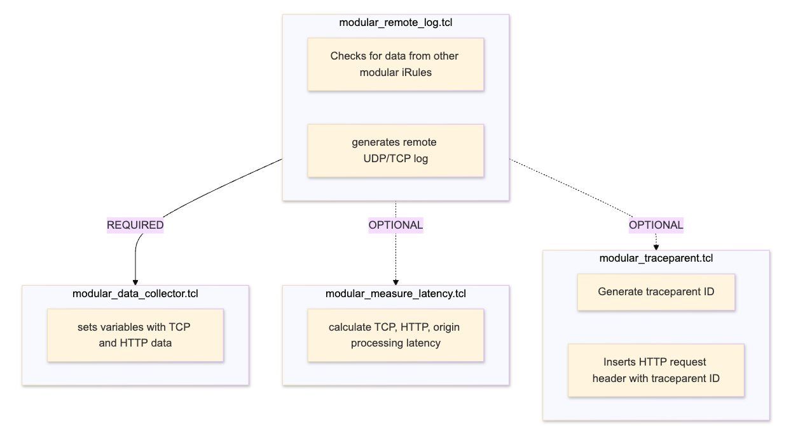

### Latest Version: 1.1.0



### Different combinations of modular iRules applied to a virtual server activates different features:

| iRule | Requires | Send TCP/UDP log  | Collects TCP + HTTP data | Calculate/insert server timing latency | Generate/insert traceparent ID |
| :------ | :------ | :----- | :------ | :------ |  :------ |
|  modular_remote_log.tcl  |  modular_data_collector.tcl  |   Yes  |  | | |   
|  modular_data_collector.tcl  |  n/a  | | Yes | | |   
|  modular_measure_latency.tcl  |  n/a  | | | Yes | |   
|  modular_traceparent.tcl  |  n/a  |     |  | | Yes|   

#### Version History

#### 1.1.0

New Features:  
- All HTTP headers to be logged are contained in a user-defined list in iRule modular_data_collector.tcl variable `dc_httpHeaders`.  
    - Example `"Upgrade Sec-WebSocket-Version User-Agent Referer Content-Type Content-Length"`
- Improved error logging when TCL exception occurs.   

Behavior Changes:
- The logged field name for a few previously collected HTTP headers has changed due to the new feature:
    - **Before** ==> **After**
    - userAgent  ==> http.User-Agent
    - reqLength  ==> http.Content-Length
    - cType      ==> http.Content-Type
    - referrer   ==> http.referrer
- Also due to the new feature, when no HTTP header is present for the previously collected headers User-Agent, Content-Length, Content-Type, Referrer the field will now be omitted from the remote log. Previously an empty HTTP header would still log an empty `field name=""` value. 
#### 1.0

New Features:  
- all features from [server-timing-v5](https://raw.githubusercontent.com/megamattzilla/iRules/master/LTM_Server_Timings/) iRule as modular functions.
    - Generates log for successful HTTP response (with request details), HTTP request blocked by iRule, and HTTP request blocked by ASM.   


### Example Output: 
  
#### Server-Timing Header
Generated by modular_measure_latency.tcl:  
`Server-Timing: f5, overhead;dur=1, origin;dur=2, client-ssl;dur=6, server-ssl;dur=12, client-tcp;dur=5, server-tcp;dur=1`

#### Example Logs

All modular iRules applied, HTTP request blocked by other iRule, 2nd request is TCP-reuse: 
```
hostname="15-1-demo.f5kc.com",tcpID="11724352192245427",cIP="192.168.5.3",cPort="15878",uri="/bad",host="192.168.1.11",method="GET",reqLength="0",vs="/Common/asm-demo-https",referrer="",cType="",userAgent="curl/8.6.0",httpv="1.1",statusCode="403",vip="192.168.1.11",iRuleBlock="True",tcpReuse="False",cTCP="4",cTLS="77",traceparent="00-ba535444b07b6e5c572e0448376ab14a-3f0d823f089de908-01""
  
hostname="15-1-demo.f5kc.com",tcpID="11724351790531605",cIP="192.168.5.3",cPort="15210",uri="/bad",host="192.168.1.11",method="GET",reqLength="0",vs="/Common/asm-demo-https",referrer="",cType="",userAgent="curl/8.6.0",httpv="1.1",statusCode="403",vip="192.168.1.11",iRuleBlock="True",tcpReuse="True",traceparent="00-2e8619c8a022735cb32c46336319ceed-25d01b7065ed35bb-01"
```


All modular iRules applied, HTTP request blocked by ASM, 2nd request is TCP-reuse:
``` 
hostname="15-1-demo.f5kc.com",tcpID="11724351790722200",cIP="192.168.5.3",cPort="15214",uri="/passwd",host="192.168.1.11",method="GET",reqLength="0",vs="/Common/asm-demo-https",referrer="",cType="",userAgent="curl/8.6.0",httpv="1.1",statusCode="403",vip="192.168.1.11",asmBlock="True",tcpReuse="False",cTCP="4",cTLS="5",f5Req="1",traceparent="00-10a9d95ff87db89961c596a69750c1be-1c45a2c959814b70-01"
 
hostname="15-1-demo.f5kc.com",tcpID="11724351790531605",cIP="192.168.5.3",cPort="15210",uri="/passwd",host="192.168.1.11",method="GET",reqLength="0",vs="/Common/asm-demo-https",referrer="",cType="",userAgent="curl/8.6.0",httpv="1.1",statusCode="403",vip="192.168.1.11",asmBlock="True",tcpReuse="True",f5Req="1",traceparent="00-7880eb969fa5216ce90c1cb165657770-764a3c9021de6752-01"
```


All modular iRules applied, HTTP response is about to be send to client, 2nd request is TCP-reuse: 
```
hostname="15-1-demo.f5kc.com",tcpID="11724351790531605",cIP="192.168.5.3",cPort="15210",uri="/",host="192.168.1.11",method="GET",reqLength="0",vs="/Common/asm-demo-https",referrer="",cType="",userAgent="curl/8.6.0",httpv="1.1",statusCode="200",http.response_content_length="0",pool="/Common/nginx-https 192.168.0.102 443",tcpReuse="False",cTCP="29",cTLS="80",f5Req="3",sTCP="0",sTLS="15",poolRes="2",f5Res="1",overhead="4",traceparent="00-59c4345d84a358f81ff259d2642aa282-4daed742dcf93cf4-01"
  
hostname="15-1-demo.f5kc.com",tcpID="11724351790531605",cIP="192.168.5.3",cPort="15210",uri="/",host="192.168.1.11",method="GET",reqLength="0",vs="/Common/asm-demo-https",referrer="",cType="",userAgent="curl/8.6.0",httpv="1.1",statusCode="200",http.response_content_length="0",pool="/Common/nginx-https 192.168.0.102 443",tcpReuse="True",f5Req="1",poolRes="2",f5Res="1",overhead="2",traceparent="00-bca1f1f5f6488c2cc1b429b24eb836a0-abbbafdcde4bf209-01"
```