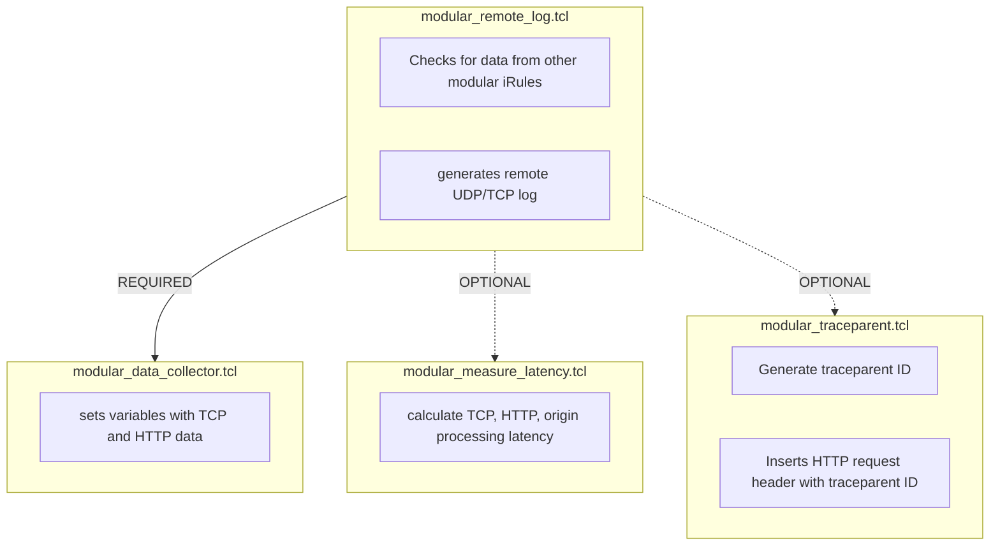

```mermaid
flowchart TB
 subgraph modular_remote_log.tcl["modular_remote_log.tcl"]
        n1["Checks for data from other modular iRules"]
        n2["generates remote UDP/TCP log"]
  end
 subgraph modular_measure_latency.tcl["modular_measure_latency.tcl"]
        n6["calculate TCP, HTTP, origin processing latency"]
  end
 subgraph modular_data_collector.tcl["modular_data_collector.tcl"]
        n3["sets variables with TCP and HTTP data"]
  end
 subgraph modular_traceparent.tcl["modular_traceparent.tcl"]
        n4["Generate traceparent ID"]
        n5["Inserts HTTP request header with traceparent ID"]
  end
    modular_remote_log.tcl -- REQUIRED --> modular_data_collector.tcl
    modular_remote_log.tcl -. OPTIONAL .-> modular_measure_latency.tcl & modular_traceparent.tcl
```

